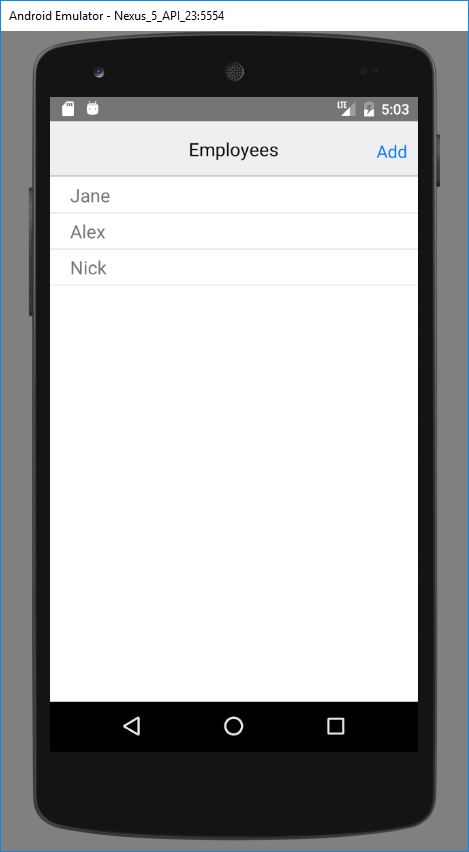
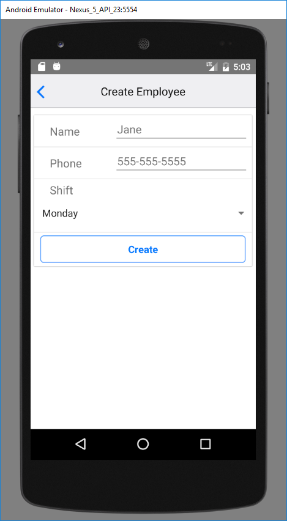
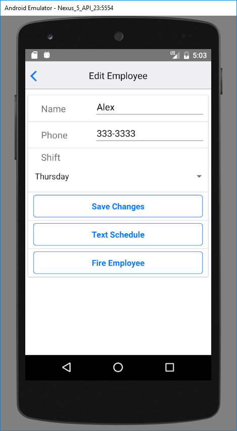

# Manager App

This project is a simple phone app that I made to enhance my understand of React Native and Redux for phone apps.

It features a login system (with Firebase as the underlying backend) that allows users to manage employees.
The employees can be added at any time, with details such as Name, Phone and Shift.

Users can edit the employee profiles, as well as text them, which launches the SMS app with a SMS to send to the selected employee.
Users also have the ability to fire the employees, which will remove them.





###Usage###

Requirements:

1. Node.js
2. React Native
3. Android Studio with an Android Virtual Device emulator

Steps:

1. Clone this project and extract it on your computer
2. Open Android Studio and run an Android Virtual Device
3. Open a terminal and change to the project directory
4. Enter the following commands:

	```
		> npm install
		> react-native run-android
	```
